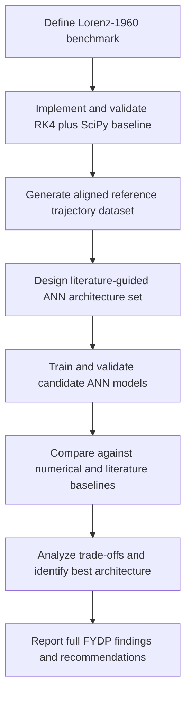

## 1.4 Methodology (FYDP Draft ~500 words)

This research will follow a phased methodology for studying the Lorenz-1960 three-equation initial value problem and for identifying an ANN architecture that can approximate its solution accurately under a controlled and defensible experimental setting. The methodology therefore covers the full FYDP-I/II/III research program: numerical baseline construction, ANN architecture experimentation, and final comparative synthesis. However, the work is intentionally staged so that the early implementation phase establishes a trustworthy numerical foundation before any architecture-level ANN conclusions are drawn. This structure is necessary because the Lorenz-1960 system is nonlinear and coupled; therefore, an error in the mathematical formulation or numerical baseline would invalidate all later model comparisons (Lorenz, 1960; Matthews & Bihlo, 2025).

The first stage is benchmark formulation and numerical baseline construction. The Lorenz-1960 equations will be taken from the accepted local authority chain, with fixed parameters, initial conditions, and time interval, and implemented as a shared right-hand-side function. The system will then be solved using two classical methods: a custom fourth-order Runge–Kutta implementation for transparency and a high-accuracy SciPy solver for reference comparison. The outputs of both solvers will be aligned on a common time grid and examined through time-series plots, trajectory plots, and error curves. Agreement between the two methods, together with step-size sensitivity checks, will be used to validate the reference solution rather than assuming that one solver is automatically correct. This first stage corresponds to the current FYDP-I implementation boundary and produces the validated numerical trajectories needed for all later phases (Matthews & Bihlo, 2025; Chen et al., 2019).

The second stage is dataset preparation and problem framing for learning. Once the numerical baseline has been validated, the Lorenz-1960 solution will be recast as a supervised approximation problem in which time is used as input and the three state variables are used as outputs. The reference trajectory will be sampled densely enough to preserve the benchmark dynamics while remaining computationally manageable on standard student hardware. Training, validation, and testing subsets will be created from the same validated trajectory so that later ANN performance can be measured against a consistent target. This stage also includes fixing the evaluation protocol, error metrics, and reproducibility settings before the main model experiments begin.

The third stage is architecture design and training. A literature-guided family of plain feedforward ANN models will be constructed by varying depth, width, activation function, and optimization strategy within a feasible search space rather than attempting an unlimited architecture sweep. This is consistent with the surrounding literature: physics-informed approaches and DeepONets show that neural models can approximate differential-equation solutions, while ANN surveys indicate that architecture and constraint-handling choices materially affect performance (Pratama et al., 2022; Raissi et al., 2017; Lu et al., 2021). Each candidate model will be trained on the Lorenz-1960 reference data and evaluated under the same protocol so that differences in performance can be attributed to architecture choices rather than inconsistent data generation.

The fourth stage is comparative evaluation and interpretation. The trained ANN models will be compared using quantitative error measures such as mean squared error, mean absolute error, root mean squared error, and maximum absolute error, together with training stability and qualitative agreement of the predicted trajectories with the validated numerical reference. The best-performing ANN configuration will then be interpreted relative to relevant published methods, particularly the DeepONet-based Lorenz-1960 treatment in PinnDE and the broader neural differential-equation literature. This comparison will not claim that plain ANNs replace all physics-informed methods; instead, it will determine how far a simple data-driven architecture can go on this benchmark and under what limitations (Matthews & Bihlo, 2025; Lu et al., 2021; Chen et al., 2019).

The final stage is synthesis of findings across FYDP-I, FYDP-II, and the concluding reporting phase. The study will combine mathematical formulation, validated numerical implementation, architecture comparison, and literature-based interpretation into a final recommendation on which ANN design offers the best trade-off among accuracy, simplicity, stability, and reproducibility for the Lorenz-1960 problem. In this way, the written methodology reflects the complete year-long research program, while the actual code implementation remains phased, beginning with the numerical baseline and expanding to ANN experimentation only after that baseline is secure. Accordingly, the current FYDP-I implementation covers only Phase 1 of this methodology—the benchmark formulation, numerical solution, visualization, and validation pipeline—while ANN experiments and final comparative synthesis belong to the subsequent research phases.

## Methodology Diagram (Mermaid)

## Questions for Clarification (If Any):

- No blocking gaps. This revised version assumes the written methodology should cover the full FYDP research program, while only the current implementation work remains limited to the numerical-baseline phase.
